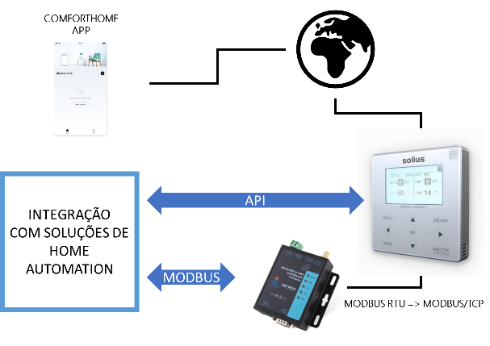
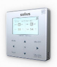
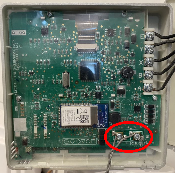
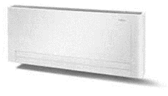
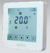
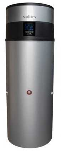

# Solius
Integração aplicacional com soluções Solius - HomeAssistant

```
Nota: Esta código não é suportado oficialmente pela Solius. É um esforço de comunidade. Utilize por sua conta e risco.
```

As soluções de climatização da Solius são económicas, fiáveis e possuem boa assistência, quer por parte dos instaladores, quer pela casa mãe.

No entanto, não existem soluções de integração com aplicações de domótica. Cada sistema provém de um fabricante diferente e não é fácil harmonizar e consequentemente automatizar a nossa casa.

A Solius fornece uma solução de controlo que além de não ser económica, não permite a integração com home assistant.

Devido a esta falta de integração, comecei a explorar a ligação aos sistemas. Comecei pelos sistemas que possuo mas espero poder ampliar a solução para outros equipamentos. Todo este código é open source e com uma licença MIT de utilização.

Vou prioritizar a integração com Home Assistant mas o código deverá poder ser portado para outras plataformas.

## Conectividade

Além das soluções proprietárias dos fabricantes, há três formas de ligar aos equipamentos. Cada forma tem vantagens e desvantagens:

Forma | Vantagem | Desvantagem
----- | -------- | -----------
1.API na cloud | O acesso via cloud está garantido | O equipamento está sempre ligado. Se não existir ligação à internet pode não haver acesso remoto. A aplicação ConfortHome utiliza esta ligação. Para poder utilizar esta API teriamos que saber a chave de desencriptação desta API.
2.API local | a solução comunica localmente, não depende da ligação a sistemas exteriores | O controlo remoto fica a cargo da solução de domótica. Tal como na solução de API na cloud, é necessário conhecer o mecanismo de desencriptação local.
3.Porta ModBus | Podemos ligar um conversor/interface para PC ou WIFI. | Temos que instalar um adaptador localmente em cada aparelho e saber onde está a porta ModBus. Permite utilizar um adaptador mais económico que as soluçõees vendidas pelos fabricantes. Tal como a solução anterior, a comunicação para a interet tem que ser garantida pela solução de domótica. É necessário conhecer o mapeamento de mensagens Modbus para cada aparelho.



Dado que os meus ventiloconvectores não têm ligação WIFI e teria que adquirir equipamento, comecei por implementar a solução ModBus.

Para começar o desenvolvimento optei por um equipamento que me permite ligar à porta RS485 e RS232 para facilitar o desenvolvimento de soluções futuras. Não é um equipamento barato mas é util nesta fase. Além de converter Modbus RTU para TCP, tem porta Ethernet e WIFI. Pode funcionar como AP ou integrador: USR-W610 https://www.pusr.com/products/rs232/rs485-to-wifi-converters-usr-w610.html

Depois de estabelecida a comunicação, o desafio é obviamente saber qual a codificação das mensagens.

A configuração do W610 está [aqui](w610.md)


## Aerobox 



No caso do Aerobox, https://solius.pt/pt/poupanca/bombas-de-calor/bombas-de-calor-multifuncoes/aerobox-inverter-pro, a porta ModBus situa-se na parte de trás do equipamento. Os dois parafusos no canto inferior direito permitem a ligação do cabo para o conversor WIFI. 



Nota: este equipamento já possui um interface WIFI que permite o controlo remoto. No entanto não tenho acesso à API de comunicação. Está a enviar informação para o endereço mapp.appsmb.com e hbtapp-prod.midea.com para poder comunicar com a aplicação ComfortHome.

### Interface Modbus

Endereço | Descrição | Valores | Meus dados
-------- | --------- | ------- | ----------
40001 | Power on/off | Bit 0-Floor,1-AC(zona 1),2-DHW(T5S),3-AC(zona 2) | 2
40002 | Mode | 1-Auto, 2-Cool, 3-Heat | 3
40003 | Water Temp (T1)| | 7729
40004 | Air Temp(17-30º) | | 0
40005 | Water Tank (T5S) | 40-60 | 0
40006 | Function Setting| * | 0
40007 | Curve Selection | | 774
40008 | Forced Water Heating | | 0
40009 | Forced TBH | | 0
40010 | Forced IBH1| | 0
40011 | t_SG_Max| | 2

Esta informação é útil mas não é necessária para a operação básica:

Endereço | Descrição | Valores | Meus dados
-------- | --------- | ------- | ----------
40101 | Operating frequency | Compressor operating frequency in Hz | 0
40102 | Operation Mode | 2: cooling, 3: heating, 0:off | 0
40103 | Fan Speed | rpm | 480
40105 | Water inlet temperature | TW in | 17
40106 | Water outlet temperature | TW out | 17
40107 | T3 Temperature | Condenser temperature | 17
40108 | T4 Temperature | Outdoor ambient temperature | 18
40109 | Discharge temperature | Compressor discharge Temperature Tp | 18
40110 | Return air temperature | Compressor air return temperature in °C | 18
40111 | T1 | Total water outlet temperature in °C | 17
40112 | T1B | System total water outlet temperature (behind the auxiliary heater) °C  | 25
40113 | T2 Refrigerant liquid side temperature in °C | | 17
40114 | T2B Refrigerant gas side temperature in °C | | 17
40115 | Ta Room temperature, in °C | | 25
40116 | T5 Water tank temperature | | 25
40117 | Pressure 1 | | 1330
40118 | Pressure 2 | | 2100
40119 | Outdoor unit current | | 0
40120 | Outdoor unit voltage | | 237
40123 | Compressor operating time in hour | | 2433
40125 | Current fault | (Fault table) | 0
40126 | fault 1 | (Fault table) | 0
40127 | fault 2 | (Fault table) | 0
40128 | fault 3 | (Fault table) | 0
40129 | Status bit 1 |  | 1040 => 10000010000
40130 | Load Output |  | 0

A aplicação nodeJS "aerobox.js" exemplifica o interface com o este dispositivo.

Tem três funções simples:
- Ler temperatura - retorna array com as duas temperaturas
``` javascript
    var resp=await getAeroboxTemperature();

    let temp1=resp[0];
    let temp2=resp[1];
```
- Gravar temperatura 
``` javascript
    await setAeroboxTemperature(temp1,temp2);
```
- Debug registos - readHolding (start, length)
``` javascript
    await readHolding(0,10); //Lê os 10 primeiros registos (40000)
```
Como exemplo, ao executar a aplicação como está, a temperatura é aumentada 1 grau.

### Integração com Homeassistant

A integração com o Homeassistant é feita através de um addon:
1. `Settings` > `Add-ons` > `Add-on Store`
2. menu no canto superior direito > `Repositories`
3. Acrescente o URL `https://github.com/luisalvesmartins/solius`
4. INSTALL

## VC Slim



Se tiver o interface wifi no inverter e utilizar a aplicação innovapp pode ligar o HA ao VC. 

### Temperatura

O código a colocar na definição de sensor é:
```yaml
- platform: rest
  name: vc1
  resource: http://****IP****/api/v/1/status
  json_attributes:
    - "net"
    - "setup"
    - "RESULT"
  timeout: 15
  value_template: "OK"
- platform: template
  sensors:
      vc1_set_temp:
        value_template: "{{ state_attr('sensor.vc1', 'RESULT')['sp']/10 }}"
        device_class: temperature
        unit_of_measurement: "°C"
      vc1_ip:
        value_template: "{{ state_attr('sensor.vc1', 'net')['ip'] }}"
      vc1_serial:
        value_template: "{{ state_attr('sensor.vc1', 'setup')['serial'] }}"
      vc1_name:
        value_template: "{{ state_attr('sensor.vc1', 'setup')['name'] }}"
      vc1_ambient_temp:
        value_template: "{{ state_attr('sensor.vc1', 'RESULT')['ta']/10 }}"
        device_class: temperature
        unit_of_measurement: "°C"
      vc1_water_temp:
        value_template: "{{ state_attr('sensor.vc1', 'RESULT')['tw']/10 }}"
        device_class: temperature
        unit_of_measurement: "°C"
      vc1_fan:
        value_template: "{{ state_attr('sensor.vc1', 'RESULT')['fn'] }}"
```

Para definir a temperatura pretendida, utilizar o rest_command:

```yaml
rest_command:
    vc_set_temp:
        url: 'http://{{ vc_ip }}/api/v/1/set/setpoint'
        method: POST
        content_type: 'application/json'
        payload: '{"temp":{{vc_temp}} }'
```

Invocar o comando utilizando a temperatura x 10. Exemplo:

```yaml
    tap_action:
      action: call-service
      service: rest_command.vc_set_temp
      data:
        vc_ip: 192.168.7.128
        vc_temp: '210'
```

### Power On/Off

```yaml
    vc_power_off:
        url: 'http://{{ vc_ip }}/api/v/1/set/power/off'
        method: POST
        content_type: 'application/json'

    vc_power_on:
        url: 'http://{{ vc_ip }}/api/v/1/set/power/on'
        method: POST
        content_type: 'application/json'
```

### Fan Speed

```yaml
    vc_fan_max:
        url: 'http://{{ vc_ip }}/api/v/1/set/function/max'
        method: POST
        content_type: 'application/json'

    vc_fan_min:
        url: 'http://{{ vc_ip }}/api/v/1/set/function/min'
        method: POST
        content_type: 'application/json'
```


## Solius 882 - Cronotermostato

(em desenvolvimento -  )



## AQS

(em desenvolvimento - Ecotank Silver)

Para chegar à ligação Modbus será necessário desmontar a parte superior do tanque.



## Outros equipamentos a explorar

### EcoTank Gris 300L
