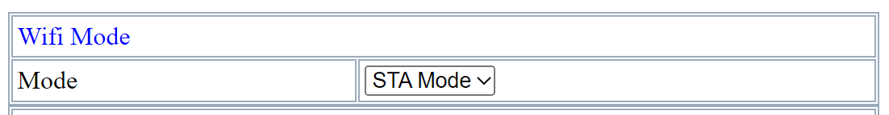
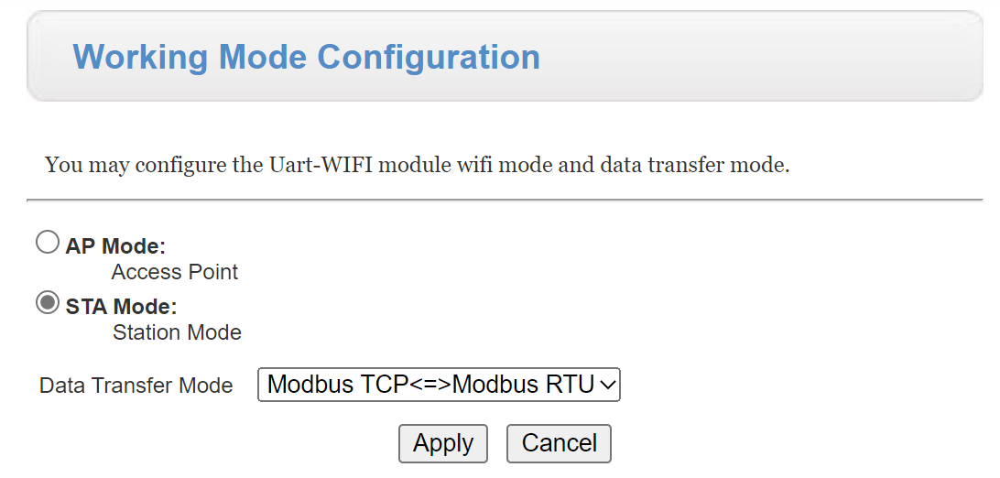
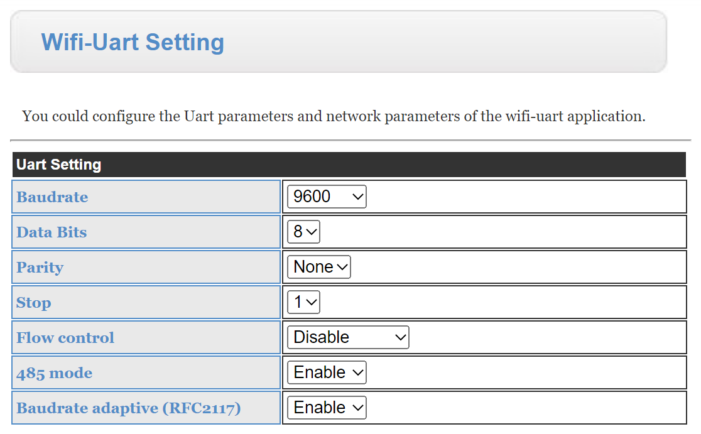
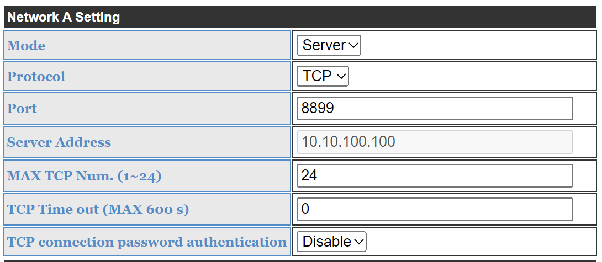

# Configuração do W610

1. Configurar modo WIFI em Station Mode (STA)

2. Colocar o modo de dados - Modbus TCP <=> Modbus RTU

3. Definir os parametros de comunicação 9600/8/N/1

4. Definir o port do servidor TCP

Fazer Restart ao dispositivo e observar se o led de TX e RX pisca.